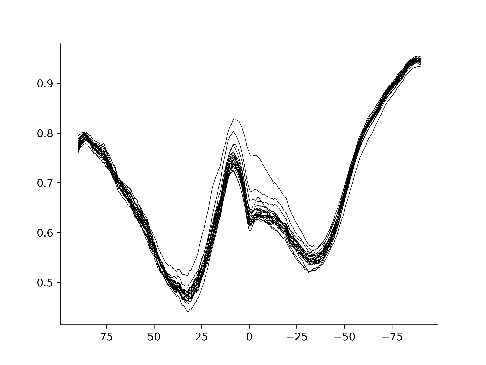
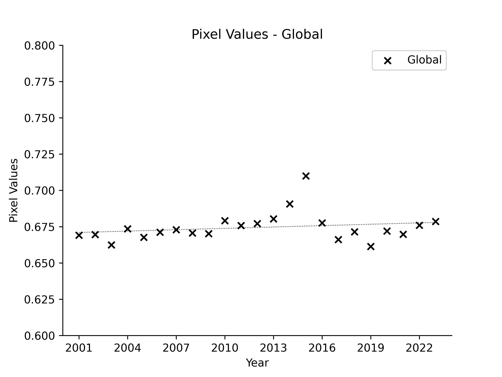

## 雲分画 (Cloud Fraction)

大気中の水分で目に見えるのは雲です。又、雨は雲から降って来ると信じられてます。それで雲の割合も検討して見ました。元データはコチラ ([CLOUD FRACTION (1 MONTH - TERRA/MODIS)](https://neo.gsfc.nasa.gov/view.php?datasetId=MODAL2_M_CLD_FR)) です。

先ず、年間の月別の移り変わりです。上が2001年、 下が2023年です。

  

次に一年間の平均画像で、2001年 (上)、2023年 (中)、そして差分 (下)です。差分では、2023年が2001年と比較し、増加もしくは不変の画素は白、減少している画素は黒で表示してます。見た目の変化は無さそうですが、画素の平均値を取って時間経過を見ます。

  

年毎の緯度にそった雲の分布パターンです。

  

そして、各年の全画素の平均値の時間経過です。増えてる様にも見えますが、増えてると言える程には変化は無い様です。

  

  [ホームページに戻る](README.md)
