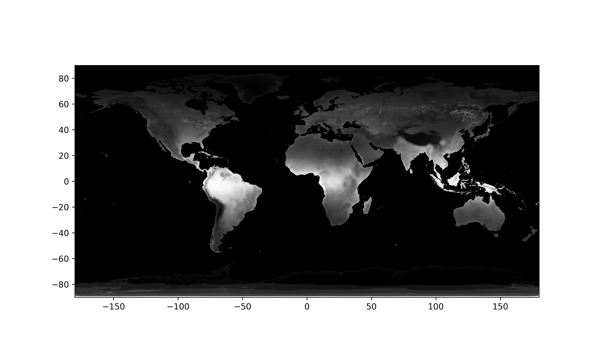

## 陸の上の水蒸気と海の上の水蒸気

大気中の水蒸気は産生された処から大気の動きと共に拡散する為、発生源付近の濃度が最も高いと期待されます。そこで、陸と海での水蒸気分布比較により水蒸気産生が何処が主かを見れるかと考え、陸と海の上空の水蒸気濃度を検討して見ました。其為に、NASAの同じサイトの "[Topology Map](https://neo.gsfc.nasa.gov/view.php?datasetId=SRTM_RAMP2_TOPO)"からマスクを作成し水蒸気画像にマスクを掛けました。上2つの画像がマスクを掛けた画像で、マスクされた部分が黒に変わってます。

是等の画像を数値化した結果を纏めたのが最下段のグラフです。此処では、熱帯 (Tropic) と緯度±60° (Global, 全体)の2種でプロットしました。所見としては、
 - 前回同様、熱帯が最も水蒸気が豊富
 - 陸と海を比較すると、熱帯でも全体でも陸の上の水蒸気が、海上の水蒸気より豊富
 - 時間経過からは、年毎に大気中の水蒸気が減少しており、熱帯の陸の上が最も顕著
     - 熱帯の海上の水蒸気は、特に近年は、落着いてる

以上より、大気中の水蒸気は、陸地からの産生が優位で、熱帯地域での水蒸気産生が減少してる為、大気中の水蒸気が減少している可能性が示唆されました。

### 陸地

### 海

### 時間経過

  [ホームページへ戻る](README.md)
