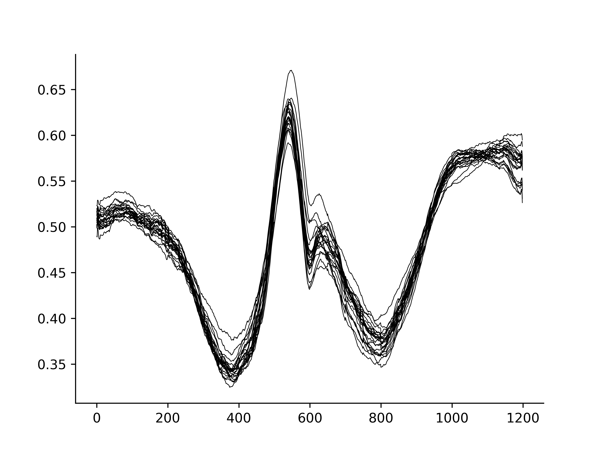
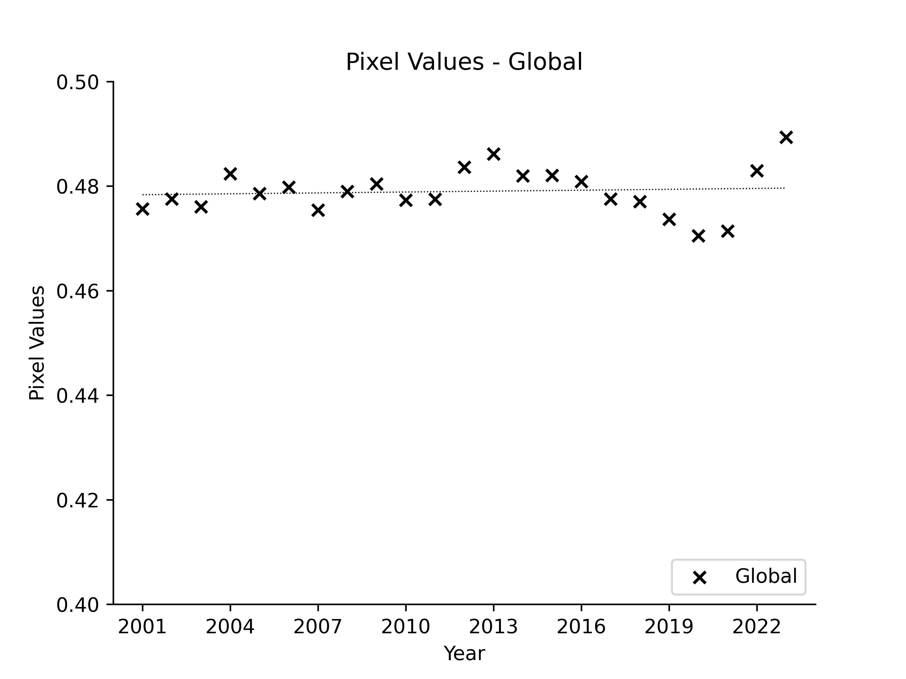

## 降雨(Rainfall)

雨は空の水蒸気が水滴・雪片・氷と成り地表に落ちで来た水分です。全地球的には、温暖化に伴ない気温や[登録：かいめんおんど]海面温度・地温が上昇しつつ有るので、大気中の水分は増えてる様に期待してましたが、大気中の水蒸気は減っています。大気中の水分の減少に伴ない、直接天候を左右する雨のパターンが変化してるか見てみました。データのソースは、NASAの同じシリーズ [RAINFALL (1 MONTH - IMERG)](https://neo.gsfc.nasa.gov/view.php?datasetId=GPM_3IMERGM)です。

### 2001年と2023年の比較
2001年 (上)と2023年 (下)の1ヶ月毎の画像をGif動画にしました。

2001年の平均した画像 (上)と2023年の平均画像 (中)、2つの画像の差分 (下)で2023年が減少した画素が黒、不変もしくは増加が白です。

Water Vaporの時と同じ方法で、各年の緯度毎の平均値を23年分オーバープロットしました。以上より、全体として特に差は無い様です。

南緯60°から北緯60°の全画素の年毎の平均値をラインプロットしました。縦軸の原点は縮尺に合せて設定してます。一定の傾向は無さそうですが、此処 2-3年は増加傾向の様です。参考までに、点線はpyhton, numpyでフィットさせた結果ですが、正の勾配でした。

大気中の水蒸気が減少してるのに、雨は不変もしくは多少増加傾向が見られるという所見は、大気の水循環が思われていたより複雑という現実を表現してるのかもしれません。
