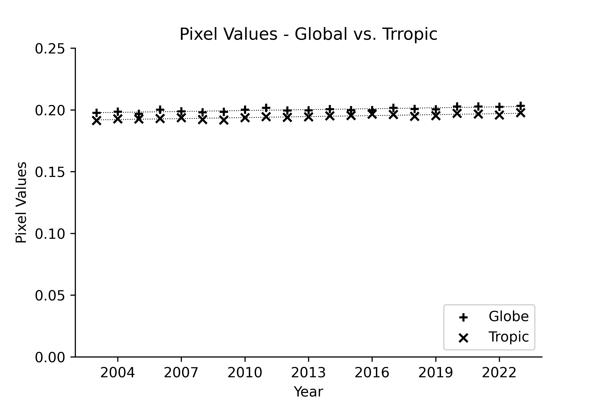
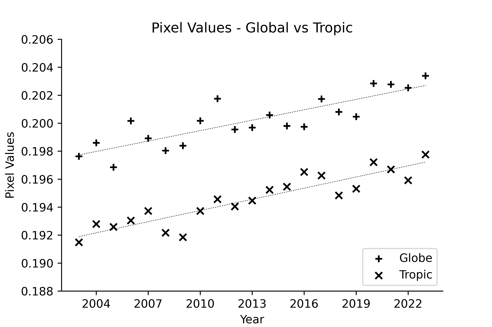

## 植生 (Vegetation Index)

大気中の水蒸気は、1. 海水面, 2. 地面, 3. 植生から発出されます。物理の法則では、温度が上昇すると1,と2.は増加するはずですので、大気中の水蒸気の減少は植生が減少している可能性が考えられます。其処で同じくNASAの衛星画像から、植生(Vegetation Index)に付き検討してみました ([VEGETATION INDEX [NDVI] (1 MONTH - TERRA/MODIS)](https://neo.gsfc.nasa.gov/view.php?datasetId=MOD_NDVI_M))。

是迄と同じ様に、先ず2002年(上)と2023年(下)の一年を通しての植生画像のGIf動画です。

次に、2002年(上)と2023年(中)の年間平均画像と、其の差分(下)です。差分では、2023年が2002年と比較して増加もしくは不変の画素は白、減少している画素は黒で表示してます。

以上の所見では、増加とも減少とも見え無いので、時間経過をプロットしたのが以下です。変化を見易くする為に2種類の縦軸で提示しました。予想したのとは反対に植生は増加してます。相関係数も0.9前後の高い値です。Globalは北緯60°から南緯60°、Tropicは北緯30°から南緯30°の間です。

| 通常のプロット | 縦軸拡大 |
| --- | --- |
| |  |

  [ホームページに戻る](README.md)
