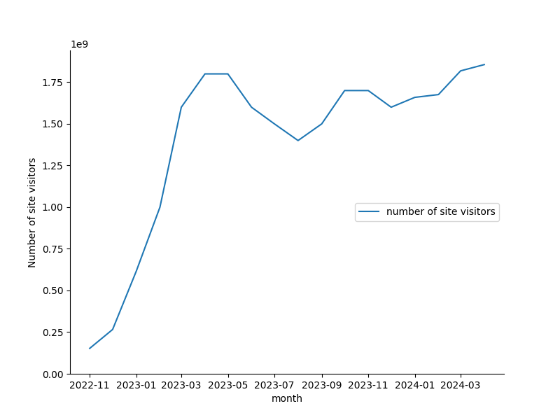
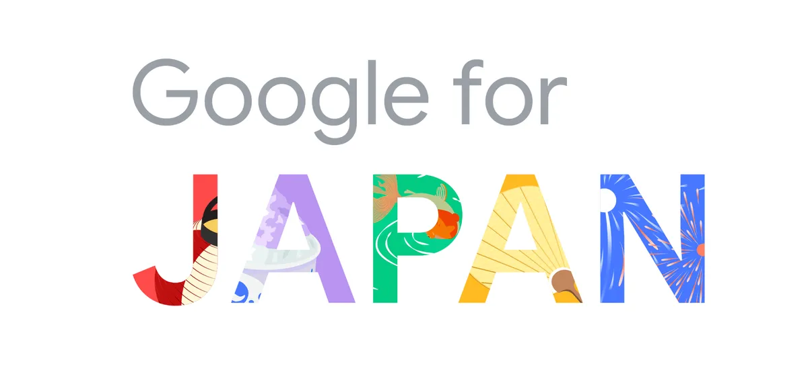

# 記事
|分類 | 日時 | 元記事 |
| --: | --: | -- |
| 人工知能 | 07-06-2024 | [自分だけの信頼できるAIへ　グーグル「NotebookLM」公開](https://www.watch.impress.co.jp/docs/news/1597789.html)|
|  |  | [NotebookLM](https://notebooklm.google/)|
| マーケティング| 10-06-2024|[電通、3D空間メディアのマーケティング効果を測る指標 「ブランドイマーシブタイム」を提唱](https://www.dentsu.co.jp/news/release/2024/0610-010736.html)|
| マーケティング  |11-06-2024  | [アップル、AI本格展開　個人をアシストする「Apple Intelligence」](https://www.watch.impress.co.jp/docs/news/1598988.html)|
| マーケティング | 21-05-2024 | [Copilot+ PCは、コンピュータが人間を理解する第一歩になる](https://pc.watch.impress.co.jp/docs/news/1593286.html)|
| | |"Copilot+ PC向けに提供されるWindows標準のAIアプリケーションのデモを行ない、「Recall」、「Cocreator」、「Live Captions」などのデモを行なった。こうしたWindows標準のAIアプリケーションはCopilot+ PC向けに提供され、SurfaceとともにMicrosoftのオンデバイスAIソリューションの「ショーケース」の役目を果たすことになる。 "|
| マーケティング |  21-05-2024  | [マイクロソフトのAIパソコン「Copilot+ PC」がすごいところ](https://ascii.jp/elem/000/004/199/4199745/)|
|マイクロソフト  |   21-05-2024  | [Copilot+ PC の紹介](https://news.microsoft.com/ja-jp/2024/05/21/240521-introducing-copilot-pcs/)|
| 評論 ([wired.jp](https://wired.jp/article/apple-intelligence-ai-feature-not-product/) )|15-06-2024 | "「製品としてのAI」ではなく「機能としてのAI」へのシフト"|
| ||"ブラウザーの新しいウィンドウやアプリを開いたり、カット&ペーストをしたり、ときにはチャットボットの熱に浮かされたようなまとまりのない言葉を理解しようと努めたりする行為を伴うものだった。"|
|  マーケティング   | 20-06-2024  |[グーグル 47都道府県の地域課題に特化したAIモデル開発へ](https://www3.nhk.or.jp/news/html/20240619/k10014485861000.html)|
|  マーケティング   | 20-06-2024  |[グーグルの生成AI検索「AI Overviews」　日本でも年内開始](https://www.watch.impress.co.jp/docs/news/1601508.html)|
|  マーケティング   | 20-06-2024  |[「Google for Japan」開幕、日本がリードするグーグルの最新技術を紹介](https://k-tai.watch.impress.co.jp/docs/news/1601557.html)|
| 検索| 20-06-2024 | [グーグル、「ハッシュタグ検索」を開始　日本発の“推し”検索](https://www.watch.impress.co.jp/docs/news/1601174.html) |
| 評論| 22-06-2024|[海のものとも、山のものともつかないモラトリアム](https://pc.watch.impress.co.jp/docs/column/config/1602336.html)|
| 華為技術 | 22-06-2024 |[Huawei's system upgrade breaks a 'two-horse race'](https://www.shine.cn/biz/company/2406219336/) |
| 能力 | 26-06-2024 | [いい意味でヤバいClaude 3.5 Sonnet！6月ホットなAI関連話題を総ざらい](https://pc.watch.impress.co.jp/docs/column/nishikawa/1602697.html) |
|||"Claude 3.5 Sonnetが出したコードは完全に正解。ほかにも実践的な内容を尋ねてもほぼ正解。これには筆者も正直驚いてしまった次第だ。"|
| 評論| 27-06-2024|[生成AIのバブルはいつ弾ける？](https://pc.watch.impress.co.jp/docs/column/tidbit/1603220.html)|
|||生成AIのマーケットの売上と呼ばれているものの半分位がNVIDIAの売上だったりする。|
|生成現実 | 01-07-2024 | [「映像」から見るApple Vision Proの本気度](https://www.watch.impress.co.jp/docs/series/nishida/1604390.html) |
|生成現実 | 11-06-2024 |[「Apple Vision Pro」日本発売、どんなところが変わっていくのか](https://av.watch.impress.co.jp/docs/series/rt/1599087.html)|
| | | 「没入感のある新しいコンテンツ制作の後押しが始まっている」|
|生成現実 | 19-06-2024  | [XREALが「空間ビデオ撮影可能なAndroidデバイス」発売。CEOに開発意図を聞いた](https://av.watch.impress.co.jp/docs/series/rt/1600879.html) |
|生成現実 | 02-07-2024| [「映像」から見るApple Vision Proの本気度](https://www.watch.impress.co.jp/docs/series/nishida/1604390.html)|
|生成現実 | 04-07-2024 | [Apple副社長と対談。Apple Vision Proは世界を変えるのか？ with Bob Borchers](https://www.youtube.com/watch?v=pSry1XLbS00) |
| 量個知能 | 05-07-202 |[AI PCは今後3年でPC出荷全体の60%に。Lenovoのルカ・ロッシが予測](https://pc.watch.impress.co.jp/docs/column/gyokai/1605861.html)|
||| "自分のことを、自分よりも知ってくれるような存在" |
| 生成現実 | xx-06-202| [Apple Vision Proを3ヶ月間使って感じた本音。](https://www.youtube.com/watch?v=fGAym_JlufA) |
||| "Apple製品ってその製品を通じて人と人をとつなげたりとかクリエーティブな創作活動を行なったりとか、... その要素が欠けてる" |
|生成現実 |  09-07-202 | [【購入3週間レビュー】 Apple Vision Pro、ぶっちゃけまだ使ってる？ YouTube](https://www.youtube.com/watch?v=CJkhU2PZaz8) |
| 人工知能 | 16-07-2024| [新GalaxyとAIスマホの競争　プロンプト＝生成AI時代の終わり](https://www.watch.impress.co.jp/docs/series/nishida/1608407.html)|
|||「しかし、おそらくこの先になにかある。」|
| 人工知能 | 18-07-2024 | [ＡＩが誤変換する鹿児島弁、速記が頼り…鹿児島県議会事務局「ＡＩにはまだ難しい」](https://www.yomiuri.co.jp/national/20240717-OYT1T50109/2/) |
|||「辞書に登録されていない用語は誤認識する」 アドバンスト・メディア（東京）|
| 評論 |  26-07-2024 |[「ChatGPT」一強時代の終わり　狙われるAIの王座](https://ascii.jp/elem/000/004/211/4211878/)|
| マーケティング |21-07-2024| [【2024年7月最新】ChatGPTのユーザー数・登録者数まとめ](https://aisodan.com/news/100)|
||||
|生成現実 | 01-08-2024 | [高価なiPad Proを使いながら考えたタブレットの未来](https://www.watch.impress.co.jp/docs/review/review/1611321.html)|
|||「タブレットが便利なのは「四角い画面を持って使う」という前提があるからだ。」|
|マーケティング |02-08-2024|[700ドルのSnapdragon X PCが来年に登場する](https://ascii.jp/elem/000/004/212/4212914/)|
|マーケティング| 02-08-2024|[インテル１万５０００人削減へ、従業員１５％の規模…生成ＡＩ向け半導体シェア奪われ経営不振](https://www.yomiuri.co.jp/economy/20240802-OYT1T50077/)|
|マーケティング| 02-08-2024|[インテル、約1万5000人の人員削減　業績厳しく](https://ascii.jp/elem/000/004/213/4213788/)|
|||「第2四半期の業績は、主要な製品およびプロセス技術のマイルストーンを達成したものの、残念な結果となった」|
| 評論 | 02-08-2024 |[AIバブル崩壊をめぐって](https://ascii.jp/elem/000/004/213/4213937/)|
|||「「AI導入当初」段階ではAIの業務効率化・生産性向上効果により、タスク量が減少するとしています。」|
| 評論 | 12-08-2024 |[商業漫画にAIが使われるようになってきた](https://ascii.jp/elem/000/004/215/4215380/)|
|||「支援ツールとして部分的に使える可能性について、様々な人が実験を始めつつあります。」|

### Apple Intelligents
| Apple Intelligence | | &#xf8ff; |
| --- | --- | --- |
|  | Public | - [Write with intelligent new tools. Everywhere words matter.]()|
|  |  | - Delightful images created just for you.|
||| - Discover an even more capable, integrated, personal Siri.|
|  | Developer |You can bring these Apple Intelligence features right into your apps. [🍎](https://developer.apple.com/apple-intelligence/)|
||  |   - Siri can understand content from your app and provide users with information from your app from anywhere in the system..|
| | |What’s new in App Intents[🍎](https://developer.apple.com/videos/play/wwdc2024/10134/)|
|App Intents [🍎](https://developer.apple.com/documentation/appintents)||Make your app’s content and actions discoverable with system experiences like Spotlight, widgets, and enhanced action capabilities of Siri, powered by Apple Intelligence.[🍎](https://developer.apple.com/videos/play/wwdc2024/10134/)|

### Apple Vision Pro

| Apple Intelligence | | &#xf8ff; |
| --- | --- | --- |
|生成現実 |Feb. 2024 | [ A Guided Tour of Apple Vision Pro](https://www.youtube.com/watch?v=Vb0dG-2huJE) |
|生成現実 |Feb. 2024| [Introducing Apple Vision Pro](https://www.youtube.com/watch?v=TX9qSaGXFyg) |

### MicroSoft Copilot + PC

|MicroSoft | 日付 | 発表 |
| -- | -- | ------- |
|  | ?? |[Cortana のサポート終了](https://support.microsoft.com/ja-jp/topic/cortana-%E3%81%AE%E3%82%B5%E3%83%9D%E3%83%BC%E3%83%88%E7%B5%82%E4%BA%86-d025b39f-ee5b-4836-a954-0ab646ee1efa)|

### Google Gemini

|Google | 日付 | 発表 |
| -- | -- | ------- |
| 日本法人  | 19-06-2024 |[AI で日本のさらなる可能性を 〜 Google for Japan 2024 〜](https://blog.google/intl/ja-jp/company-news/technology/ai-google-for-japan-2024/)|
| |  | |
| 日本法人代表| 19-06-2024 |[日本におけるAIの 可能性に向けた提言](https://static.googleusercontent.com/media/publicpolicy.google/en//resources/japan_ai_opportunity_agenda_ja.pdf) |

