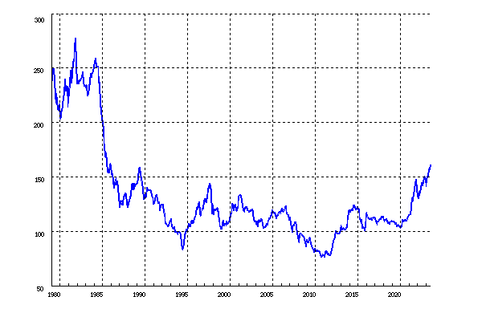
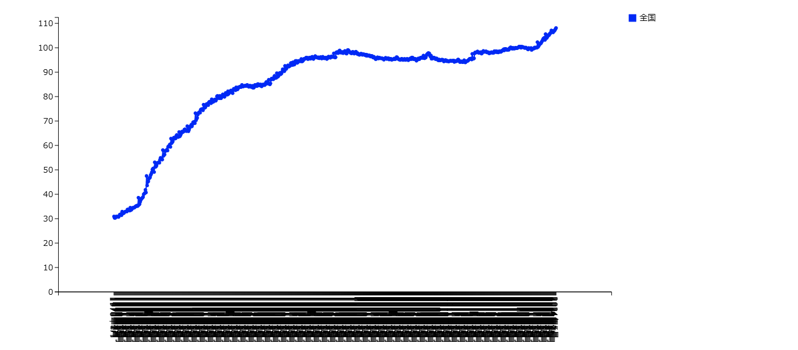

## 気象庁
- [日本の月平均気温](https://www.data.jma.go.jp/cpdinfo/temp/may_jpn.html)
- [日本の年平均気温偏差（℃）](https://www.data.jma.go.jp/cpdinfo/temp/list/an_jpn.html)
- [世界の月平均気温](https://www.data.jma.go.jp/cpdinfo/temp/jul_wld.html)
- [世界の月平均気温偏差（℃）](https://www.data.jma.go.jp/cpdinfo/temp/list/mon_wld.html)
- [大気中二酸化炭素濃度の月平均値](https://www.data.jma.go.jp/ghg/kanshi/obs/co2_monthave_ryo.html)
- [二酸化炭素濃度 球面分布図（地表付近/月平均値）| 二酸化炭素分布情報](https://www.data.jma.go.jp/ghg/kanshi/co2sphere/co2spherems.html)

## 農林水産省
- [米に関するマンスリーレポート](https://www.maff.go.jp/j/seisan/keikaku/soukatu/mr.html)
- [米の相対取引価格・数量、契約・販売状況、民間在庫の推移等](https://www.maff.go.jp/j/seisan/keikaku/soukatu/aitaikakaku.html)

## 財務省
- [国債統計年報](https://www.mof.go.jp/jgbs/publication/annual_report/index.html)
- [財務省貿易統計](https://www.customs.go.jp/toukei/info/index.htm)
- [財務省貿易統計(直近)](https://www.customs.go.jp/toukei/latest/index.htm)

## 日銀
 - [主要為替比率時系列統計データ表 (月次)](https://www.stat-search.boj.or.jp/ssi/mtshtml/fm08_m_1.html)

 - 
  
## 総務省統計局
 - [消費者物価指数（CPI）](https://www.stat.go.jp/data/cpi/index.html)

2020年基準　消費者物価指数　全国　2024年（令和6年）5月分（2024年6月21日公表）
記録は1970年1月より

