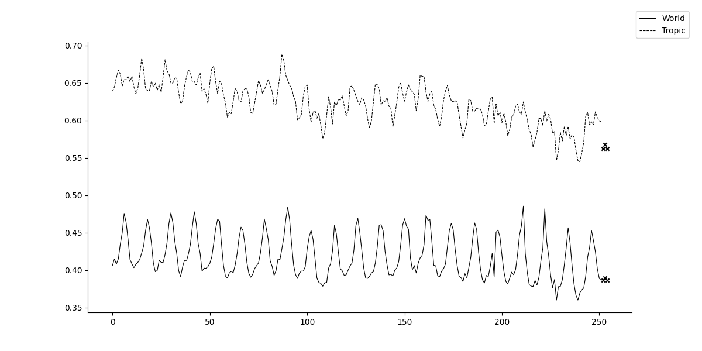
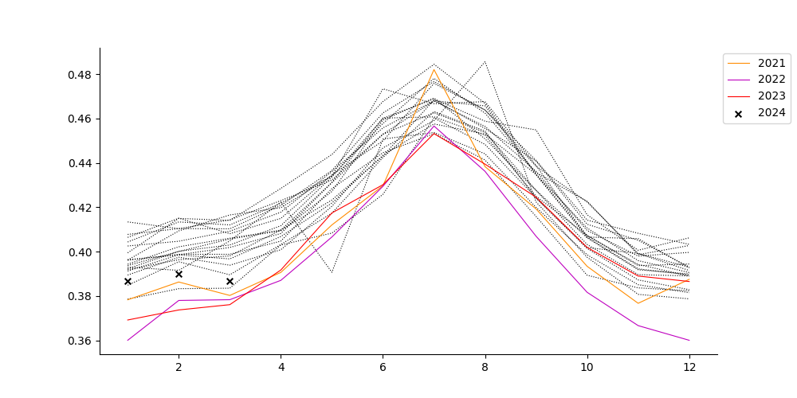
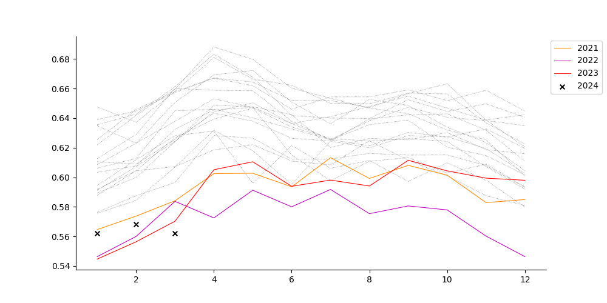

是迄の所見から、大気中の水蒸気が温暖化と関連が有る可能性が示唆されました。では、今後如何成るんだろうというのが興味です。それで、水蒸気画像の月毎の全体(南緯60度から北緯60度)と熱帯(南緯23.5度から北緯23.5度)の値を見てみました。先ず、画素値の経過です。xで示したのが2024年、今年です。縦軸の原点が0では無いのに注意して下さい。(以下、同じ)

是だけでは分り難いかと思い、1年間の経過を記録年分重ねてプロットしました。

### 全体の経過

### 熱帯の経過

同じ様に、xが2024年の値ですが、経過から予想される処から大きく外れて無い様です。

[ホームページに戻る](../README.md)
