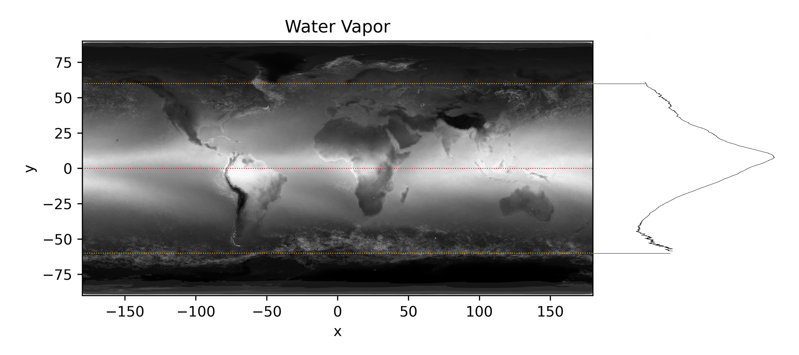
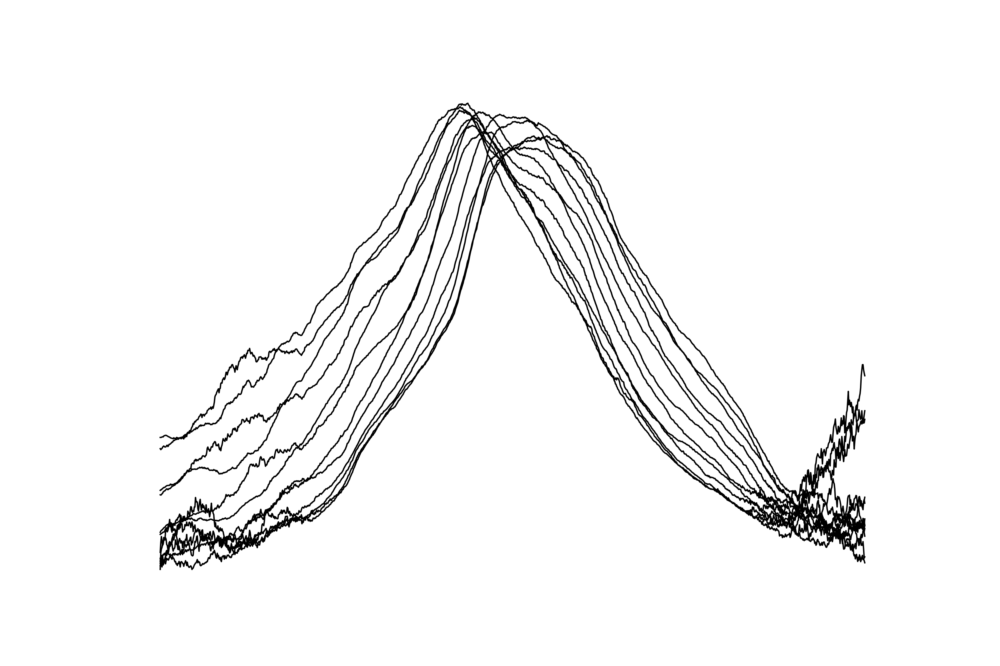
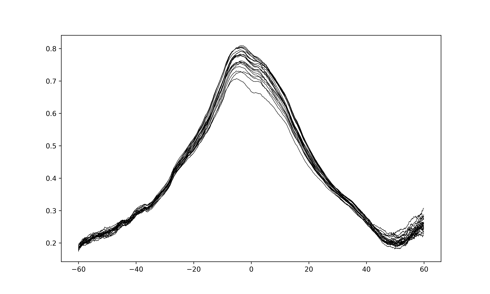
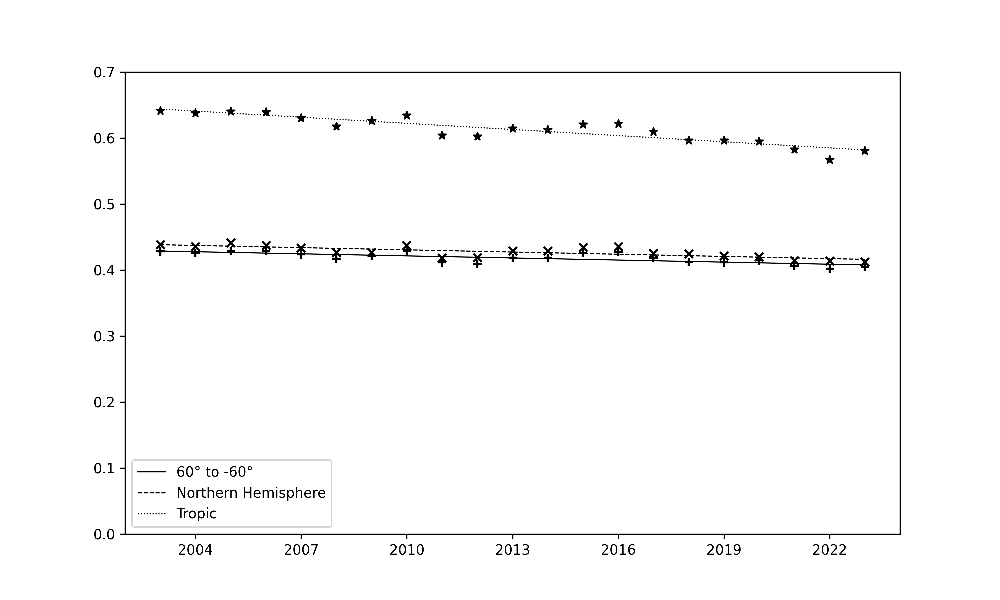

## 大気中水蒸気の経年変化
2003年と2023年の画像と動画で此の約20年間に大気中の水蒸気の減少が示唆されました。そこで、この間の画像を数値化してみます。先ず、下図の様に緯度にそって画素値の平均値を計算し、其の値を横軸に緯度上の位置を縦軸に取ります。地図中の赤の点線が赤道で、オレンジの点線が±60°でその間の画素値を対象にしました。

取り敢えずの数値化検討での所見は、大気中水蒸気の年毎の減少です ([一番下のグラフ](#大気中水蒸気の経年的変化)。下記の統計検討はデータの限界をご理解の上御覧下さい。更に定性的に検討したのが[陸の上の水蒸気と海の上の水蒸気](Land&Sea.md)です。

2003年の月毎の平均を重ねてプロットしたのが下の図です。月と共に水蒸気分布のピークが移動してるのが見て取れます。  

次に、2003年から2023年までの年間平均値を重ねてプロットしました。 順不同ですが年毎に変化してるのが確認出来ます。   

### 大気中水蒸気の経年的変化

是等の計算を纏めたのが以下の線グラフです。図で、「Tropic」は緯度±25°、「Northern Hemishpere」は赤道から緯度60°です。相関係数は-0.75から-0.9と、時間経過と大気中水蒸気濃度との間に高い負の相関が認められます。

