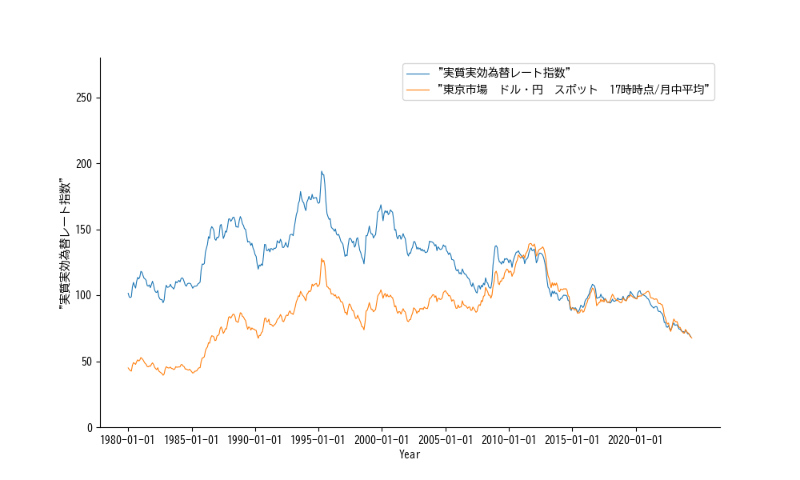
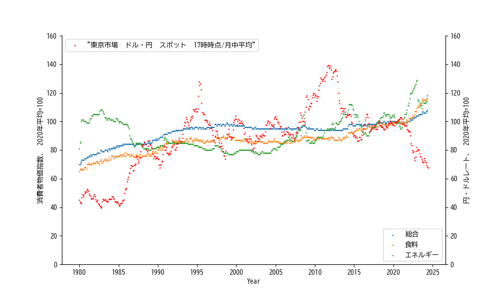

## 2.3.円・ドル為替レート

### 2.3.1. 円・ドル為替レートと実効為替レート
物価高と言えば、円安って返って来るのが世の常ですので、実際に円対ドルの為替レートと消費者物価を並べて見ようかと思います。先ず、為替レートの理解からですが、日銀が発表している為替レートに「実効為替レート」という指標が有ります。此の指標は、為替市場で売り買いされる際のレートでは無く、対象となる通貨経済圏との経済交流から算出される円の相対的価値です。日銀のウェブページには「対象となる全ての通貨と日本円との間の2通貨間為替レートを、貿易額等で計った相対的な重要度でウエイト付けして集計・算出します。」と有ります [🔗](https://www.boj.or.jp/statistics/outline/exp/exrate02.htm)。それで、東京為替市場の円・ドルの為替レートと実効為替レートとを並べてみました。東京為替市場の円・ドルの為替レートのデータはココ [主要時系列統計データ表](https://www.stat-search.boj.or.jp/ssi/mtshtml/fm08_m_1.html)、実効為替レートのデータはコチラ [主要時系列統計データ表](https://www.stat-search.boj.or.jp/ssi/mtshtml/fm09_m_1.html) です。並べてプロットするに際して、東京為替市場の円・ドルの為替レートは、円/ドルの比率を用い、2020年の平均比率を100として正規化しました。

こうやって並べて見ると、東京為替市場での為替比率と実効為替レートは必ずしも一致して無いコトが分ります。2010年以降は両者はほぼ一致してますが、其以前は東京為替市場での為替比率より円の購買力は高かった様です。如何すれば此の様な乖離が可能なのか？是が所謂「為替マニュピュレーション」に相当するのか？とか知りたければ、実効為替レートの更に深い知識が必要ですが、今は「広く浅く」ビッグピクチャーを掴む方向です。

### 2.3.2. 消費者物価指数と円・ドルの為替レート
今度は、消費者物価指数と円・ドルの為替レートを並べてプロットしました。確かに1980年頃は円の価値が上るとエネルギーの価格は下ってましたが、それ以降は為替レートと物価には余り強い関連性は無い様です。一方で、2021年-2022年から、円の価値低下と物価の上昇が進行してるのは見て取れます。此の現象の要因については貿易関係の統計から何か知見が得られ無いか、次に見てみましょう。

### 2.3.3. Pythonコード
今回用いたコードはコチラです。marimoが有用なのは、markdown形式てコメントが記録出来る処です。必要に応じて文書内リンクとかLatexで数式を、mermeidで模式図をコメントに入れ込むコトが可能になります。

 - 東京為替市場 円・ドル為替レート
     - [データ読み込み](code/exchRate.md)
 - 実効為替レート
     - [データ読み込み](code/eexchRate.md)
 - 為替レート作図 [🔗](code/exchRate(作図).md)
 - 消費者物価指数と円・ドルの為替レート [🔗](code/exRate-CPI.md)
