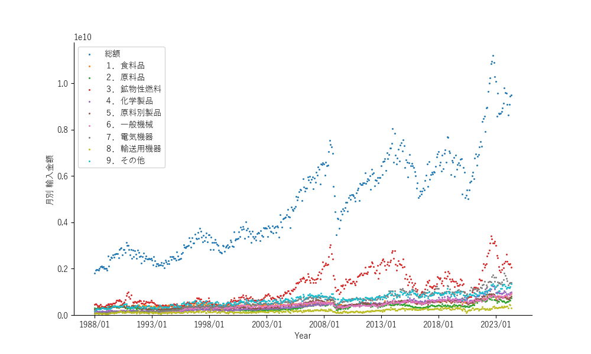
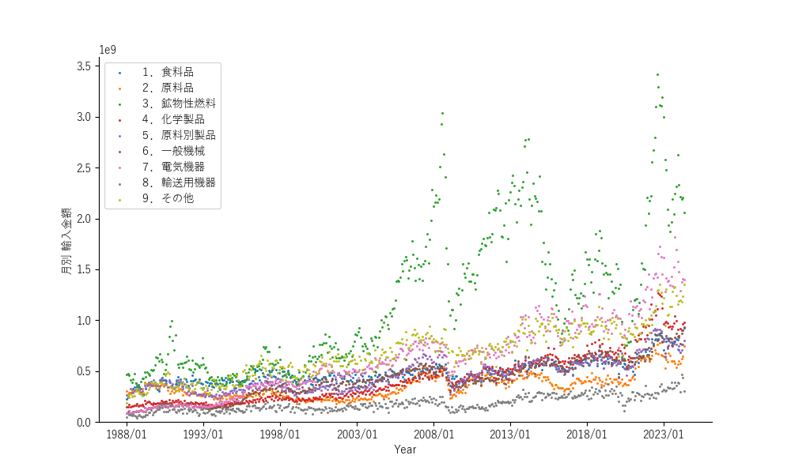
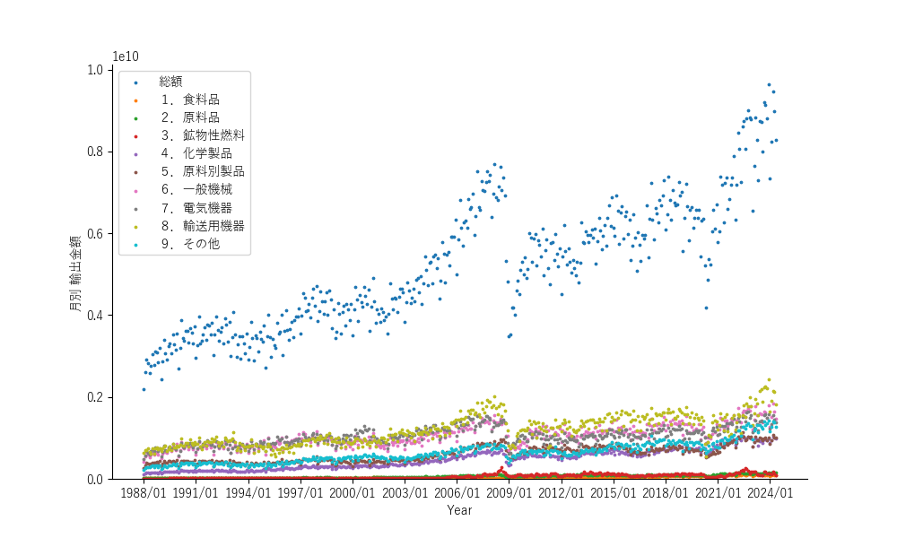
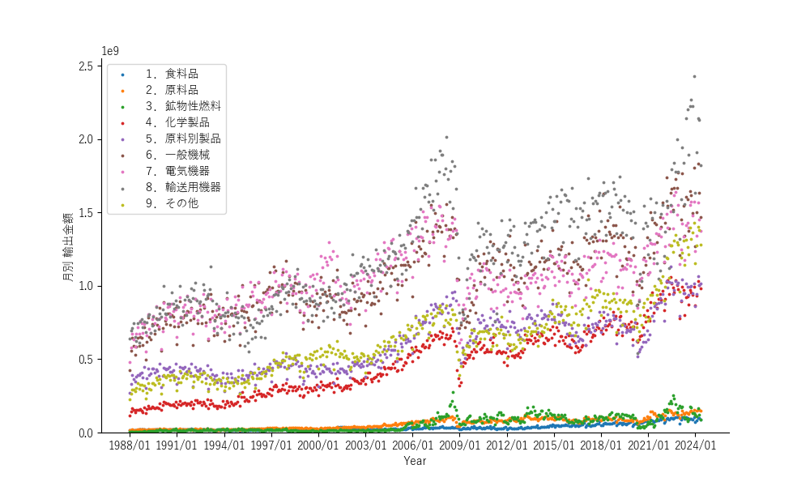

## 2.5. 貿易商品の内訳

### 2.5.1. 輸入商品の内訳

主要商品別の輸出入額の推移のデータはコチラ[🔗](https://www.customs.go.jp/toukei/suii/html/time.htm)のwebサイトに有ります。このページの2番目のテーブルの「世界（輸出入総額）」行の「世界 月別(輸出）」と「世界 月別(輸入）」です。先ず、輸入から。とりあえず、輸入総額と輸入品目大分類別の金額です。2008年、2013年と2020年に落ち込みが有ります。2008年と2020年は、それぞれリーマンショックとコロナ渦の所為でしょう。2014年前後の落ち込みはアメリカがオイル輸出を解禁した為、オイルが供給過剰となり価格が低下した為の様です。如何にオイル価格が日本の経済に大事かを示すエピソードです。

総額を外してみます。やはり鉱物性燃料が、額・変動幅ともに大きいですが、近年、電気機器、一般機械、化学製品の輸入も着実に伸びてるようです。所謂、「産業 (製造業) の空洞化」です。

### 2.5.2. 輸出商品の内訳

同じ様に輸出額もプロットします。輸入額と同じ様に2008年と2020年に落ち込みが見られますが、2014年頃の輸出に対する影響は小さかった様です。

品目別に見ると、やはり、輸送用機器つまり自動車が牽引しており、それに電気機器と一般機械が続くって感じです。一般機械には半導体作成装置も含まれますので、昨今の半導体工場建設ブームは日本経済にとっても成長要因かも。一方で、自動車メーカーの不祥事の為か直近で輸送用機器輸出に頭打ちが見られます。中国製電気自動車の動向も含め気になる処です。

トヨタの社員が不正すると、パンの値段が上るって、真に「風が吹けば桶屋が儲かる」の世界です。日本の製造業も頑張ってる様ですが、輸入の伸びに付いて行け無い。その輸入の伸びは、エネルギーの輸入に負うところが大ですが、製造業の空洞化の所為で電気機器や化学製品も輸入に頼る様になり輸入が増加してる。という訳で次はオイル価格です。
