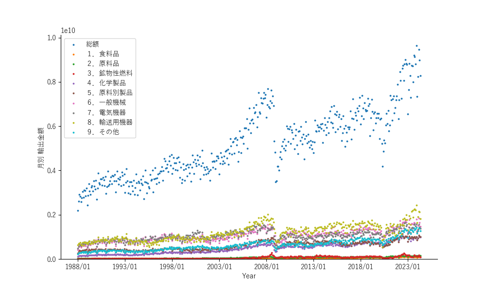

## 2.5. 貿易商品の内訳

### 2.5.1. 輸入商品の内訳

主要商品別の輸出入額の推移のデータはコチラ[🔗](https://www.customs.go.jp/toukei/suii/html/time.htm)のwebサイトに有ります。このページの2番目のテーブルの世界（輸出入総額）の行の「世界 月別(輸出）」と「世界 月別(輸入）」です。先ず、輸入から。とりあえず、輸入総額と輸入品目大分類別の金額です。

