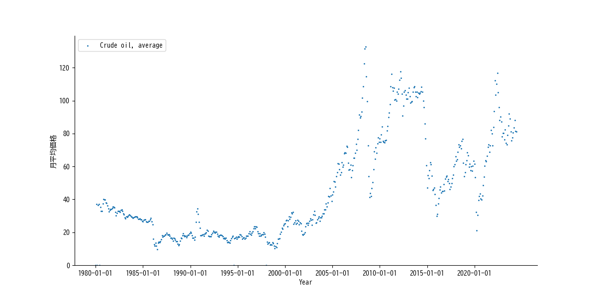

## 2.6. 原油価格の動向

原油価格はワールドバンクのウェブサイトに有ります([🔗]())。「Commodity Markets」の「PUBLICATION AND DATA, Monthly prices」です。原油価格だけで無く小麦やコーヒー、鉄鉱石の価格も載ってます。

原油価格で特徴的なのは、価格の低下は種々の要因で起きますが、価格上昇は基本的に戦争もしくは国際紛争が原因です。勿論、原油価格も紛争も人為的ですので、単なる偶然では無い。株式市場に於ける「慌て者の投資家」みたいなモンで、皆が紛争が起きたから原油価格が上ったと言うけど、実は原油価格を上げる為に紛争を起こしたって感じかと。

簡単に言うと、ウクライナと西アジアが平和になると原油価格は下る。そうすると日本の物価は落ち着くけど、オイル産業に経済依存してる欧米には困る人達が居るってことかと。
