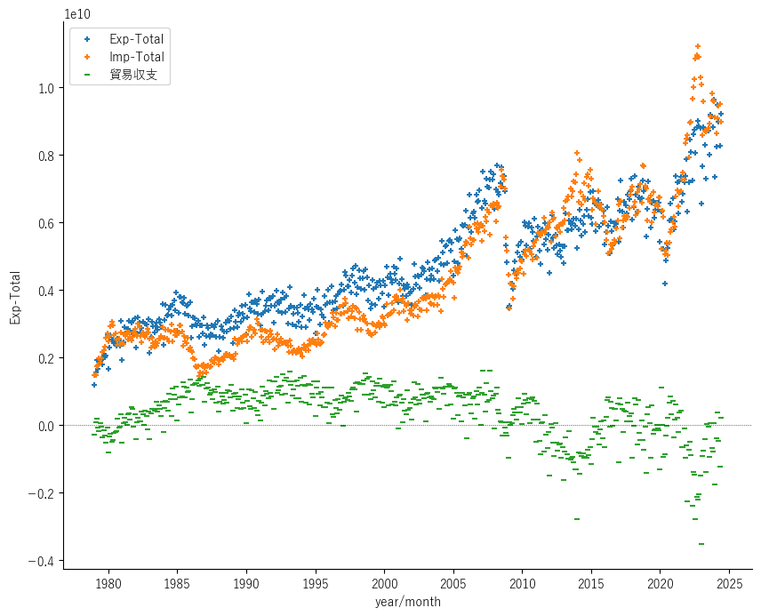

## 2.4.国際収支の推移

財務省の貿易収支のデータ公開サイトは「輸出入額の推移（地域（国）別）」 ([🔗](https://www.customs.go.jp/toukei/suii/html/time.htm)),国際収支のデータ公開サイトはコチラ[🔗](https://www.mof.go.jp/policy/international_policy/reference/balance_of_payments/bpnet.htm)です。

先ず、貿易収支からです。上記リンクのページの表から「世界（輸出入総額」の「月別推移」をプロットします。貿易収支はローカルで計算しました。データは1979年からです。

期間中の貿易の基調は拡大傾向ですが、21世紀に入り、輸出・輸入共に伸びが加速。しかし、2012年頃より輸入の伸びに輸出が追い着け無く成り、以来、次第に貿易赤字が拡大して来たようです。2008年頃の低下はリーマンショック、2020年頃はコロナ、2022年以降の急上昇はウクライナ戦争と中東紛争によるエネルギー価格と関連有るかもしれません。

此のページの「１．国際収支総括表 6s-a-2　季節調整済国際収支推移（月次）CSV」を見ます。此方はサービス収支も含まれてますが、1996年以降です。サービス収支に付いては「用語の解説 (財務省)」[🔗](https://www.mof.go.jp/policy/international_policy/reference/balance_of_payments/term.htm)をご覧ください。それで、為替比率に係る貿易収支とサービス収支の推移をプロットしました。サービス収支は基本的に赤字傾向です。  

このグラフに為替比率を書き加えたのが次です、がゴチャゴチャして見難いです。という訳で。興味の2016年以降にフォーカスしてみました。教科書どおり、貿易・サービス収支が赤字になると円の購買力が低下する様です。

