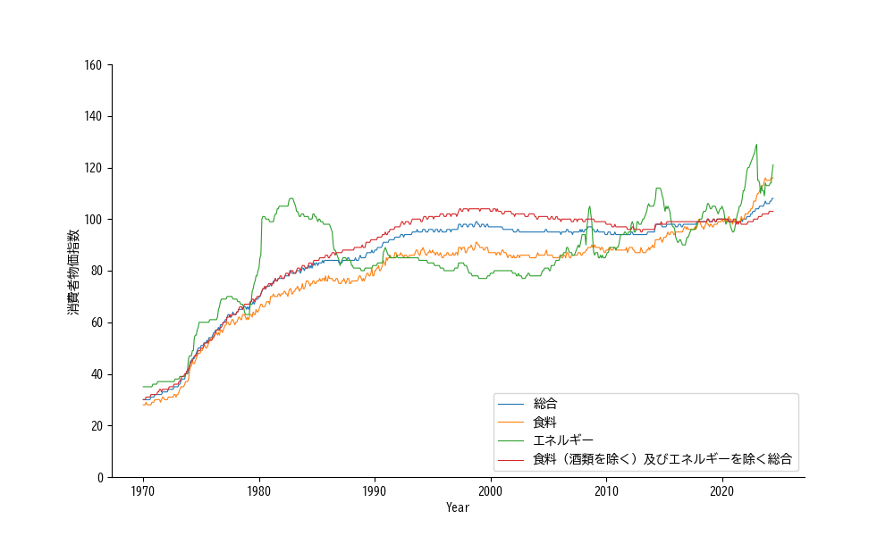
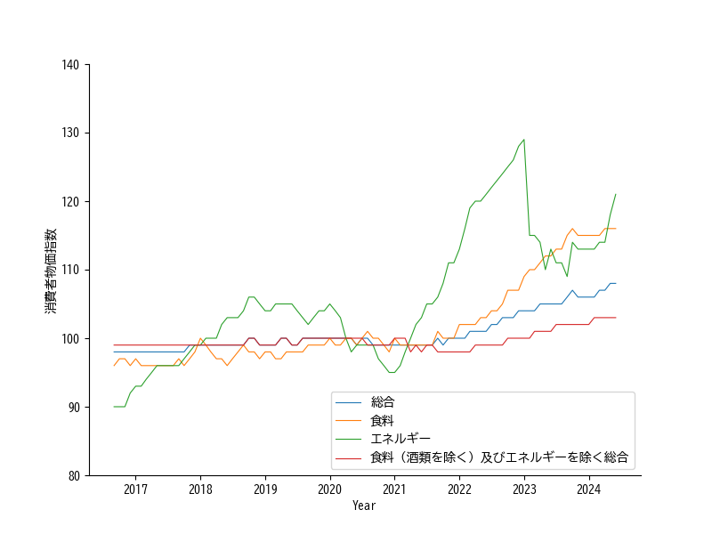

## 1. 緒言
人間の活動で最も重要な活動は、経済、つまり、お金を軸とした相互反応です。面白い事に、経済活動はお金を指標として可視化できます。つまり、お金の動きをビッグデータとして捉え、データアナリシスの対象とすれば、集団から個人としてのヒト行動様式を可視化出来る可能性が有ります。という訳で、最も大局的かつ保証されたデータが公開されている政府の経済指標についてデータを集めてみました。とりあえずは、生活に直結する処からという事で、消費者物価指数から。

## 2. 各論
### 2.1. 消費者物価指数
消費者物価指数（CPI）結果は、総務省統計局から公表されています。窓口urlは、'`https://www.stat.go.jp/data/cpi/index.html`'ですが、数値データのエクセルシートへのリンクは[コチラ](https://www.e-stat.go.jp/stat-search/files?page=1&layout=datalist&toukei=00200573&tstat=000001150147&cycle=1&year=20240&month=12040606&tclass1=000001150149) です。此処の表を辿って "統計表 1-1 中分類指数（全国）月次"の先に有るのが、1970年からの月毎の「2020年基準消費者物価指数」のエクセルシートです。尚、"2020年基準消費者物価指数"の詳しい説明はコチラ[2020年基準 消費者物価指数の解説](https://www.stat.go.jp/data/cpi/2020/kaisetsu/index.html)です。

とりあえず、全データを可視化します。全体として右肩上がりに物価は上昇してます。それ以外に、いくつか目に付く点が有ります。まず、1980年頃のエネルギー価格の高騰、所謂オイルショックですね。しかし、オイルショックが落ち着くとエネルギー価格は、比較的低い処に抑えられ、安価なオイルが2008年頃(多分リーマンショック)迄継続してます。それがリーマンショックうを契機に一転、暴れ馬の如く上下動を繰替えし、2022年のアフターコロナ頃より、物価の上昇を強力に牽引してます。

2017年以降を拡大して見ると、今何が起きてるか分ります。食料とエネルギーを除いた物価は比較的安定していて、エネルギー価格の高騰が物価上昇を引っ張てます。ところで、食料価格の上昇は地球温暖化とエネルギー価格上昇の所為と考えられます。温暖化は手を着けられ無いとすると、エネルギー価格を抑えれば生活は楽になるハズ。

いずれにせよ、物価上昇の主要因がエネルギー価格の高騰なら、その元凶の西アジアでの紛争を継続してる回教徒に文句の一つも言いたくなります。
