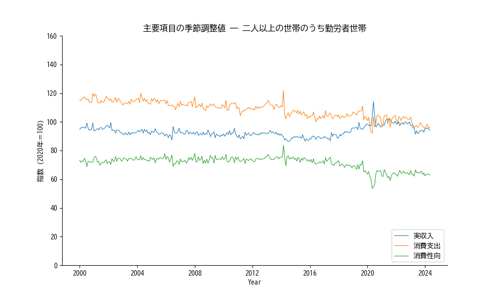
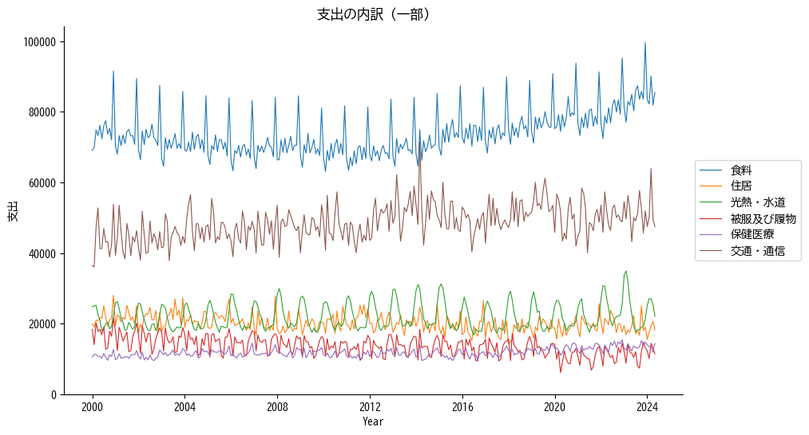

## 2.2.家計調査

二番目は、総務省が行なっている家計調査から、一般的な家庭での物価の収入と支出に対する影響を見てみます。

総務省統計局のウェブサイトでは家計調査は以下のように説明されています。[ 🔗 ](https://www.stat.go.jp/data/kakei/index.html)
> 家計調査は、一定の統計上の抽出方法に基づき選定された全国約9千世帯の方々を対象として、家計の収入・支出、貯蓄・負債などを毎月調査しています。
>　家計調査の結果は、これら調査世帯の方々の御理解・御回答によって得られており、我が国の景気動向の把握、生活保護基準の検討、消費者物価指数の品目選定及びウエイト作成などの基礎資料として利用されているほか、地方公共団体、民間の会社、研究所あるいは労働組合などでも幅広く利用されています。

データは2000年1月からですので、とりあえず「 主要項目の季節調整値 ― 二人以上の世帯のうち勤労者世帯」を見ます。リンクは [家計調査（家計収支編）　時系列データ（二人以上の世帯）](https://www.stat.go.jp/data/kakei/longtime/index.html) の第3項 「3. 主要項目の季節調整値（月）」の「[二人以上の世帯のうち勤労者世帯](https://www.stat.go.jp/data/kakei/longtime/zuhyou/season-k.xlsx)」です。大局として、収入は大体横這いですが、消費性向が緩やかに低下しています。最も簡単な解釈は、21世紀に入ってからの日本政府の経済政策は、国民が安心してお金を使える経済環境を整えるのに失敗したって感じかと。経済活動は人だけが参加する活動ですので、環境を作るのも人、つまり、日本政府で、 特に財務省と日銀です。

では、物価の消費活動に対する影響を見てみます。消費項目別の家計支出です。データは 同じページの「1. 品目分類：支出金額・名目増減率・実質増減率（月・年）」、「[月	小分類まで	支出金額	2000年1月～（CSV：281KB）](https://www.stat.go.jp/data/kakei/longtime/csv/h-mon-a.csv)」です。此方は季節調整されて無いので、例えば、食料では、正月の準備とか忘年会の所為か12月にピークが出現してます。それで、見た処、オイル価格が効いてくるはずの光熱費は比較的低く抑えられていて、上昇傾向が見られるのは、食料品と通信費です。ただ、食料安保が不安で将来を悲観するとは思え無いので、国民全体として消費を抑える傾向が何処から来るのか？も少し他のデータを見る必要が有りそうです。

コードは以下に添付しますので、此のグラフに提示されて無い項目に興味の有る人は、コードを突いて見て下さい。プログラムの拡張子は"md"ですが、プログラムはpythonで書かれてます。"md (markdown)"なのは、"marimo"というモジュールを開発環境としてインストールしていて、其処から"markdown"形式でファイルに落してます。"marimo"は"jupyter notebook"のカジュアル判みたいな感じの開発環境で、jupyter notebookより気楽に使えます。

### コード
- 主要項目の季節調整値
    - エクセルファイル読み込み [consumerIndex.md](code/consumerIndex.md)
    - データ表示 [consumerIndex表示.md](code/consumerIndex表示.md)
- 消費項目別の家計支出
    - エクセルファイル読み込み [CI-items.md](code/CI-items.md)
    - データ表示 [CI-items表示.md](code/CI-items表示.md)
