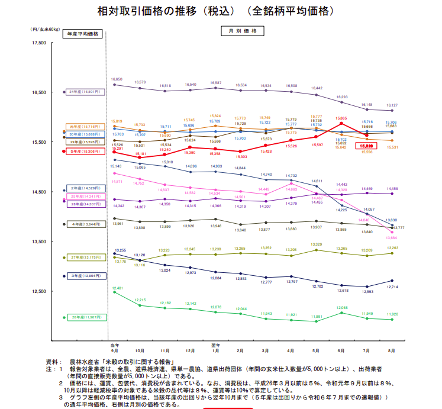
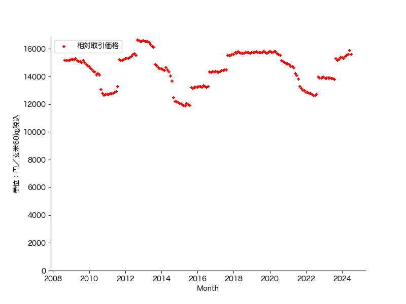

# お米の値段

お米は日本人の主食です。他の野菜や穀類と違い値段が上っても買わざるおえない。その所為で生産から流通まで政府が深くかかわっている。農林水産省はお米の需給に関してマンスリーレポートを公表し透明性を保つ努力をしている。([米に関するマンスリーレポート](https://www.maff.go.jp/j/seisan/keikaku/soukatu/mr.html)) このレポートの価格編からのグラフを下に引用します。此のグラフでは、各年のお米が穫れ初める9月から始まっていて8月で終ります。つまり、同じ年のお米がその年に何の様に値付けされたかを見る様に設定されてます。例えば、令和2年のお米は当初玄米60kg当り15,143円で取引きされてたけど、翌年の8月では13,830円まで下ったって感じです。

上のグラフでは年毎の変化が見難いので連続してプロットしたのが下の図です。御覧の様に殆どの年で9月に設定した価格を維持もしくは低下しており、供給が需要を上まわっている事が示唆されます。一方、令和5年産の米は2月位から上昇傾向を示し、意図的に米価の引き上げを狙った可能性も無きにしも有らずですが、収穫時点での需要と供給のバランスの読みが当ら無かった事を示唆してます。令和6年7月の価格低下は一等米未満のお米を市場に廻したのかもしれません。

温暖化は進行してます。需要・供給バランスの読みを外したのが、温暖化の影響を甘く見た所為なら、良い学習機会になったでしょう。
